# Cúram — System Architecture

> AI-first GP practice management platform for Ireland.
> All patient data resides in the **EU (Supabase Frankfurt)**. Every mutation is
> audit-logged (HIQA). RLS isolates every practice's data.

## 1. Components at a glance

| Component | Tech | Runs where | Purpose |
|---|---|---|---|
| **Staff web app** | React 18 + Vite + TS + Tailwind + wouter | Vercel (EU) | Booking, consultations, AI scribe, billing, CDM, workflows, inbox, prescriptions, settings |
| **MyCúram patient app** | React Native / Expo (iOS + Android) | Patient phones | Booking, repeat Rx, results (with GP-callback rule), secure messaging, CDM health log |
| **HealthLink Bridge** | Electron (Node.js), tray app | Practice PC (Windows/macOS) | Polls HealthLink HL7 v2.4 messages every 60s with the practice certificate; submits outbound eReferrals |
| **Síle voice AI** | Vapi.ai webhooks + Edge Functions | Cloud | Phone triage/booking voice calls (logged with transcripts) |
| **Supabase backend** | PostgreSQL + RLS, Auth, Vault, Storage, pg_cron | Supabase Cloud EU (Frankfurt) | Single source of truth; 21 Edge Functions; all access Row-Level-Secured |

### Supabase Edge Functions (21)

| Function | Trigger | Auth |
|---|---|---|
| `ai-scribe` | Staff web (consultation) | Staff JWT; transcription + Claude structuring routed via LiteLLM gateway (or direct keys), metered via `ai_usage_log` |
| `book-appointment` | Síle / web | Service/JWT; writes appointment + SMS confirmation + calendar push |
| `appointment-availability` | Síle / web | JWT; free slot lookup |
| `voice-appointments` | Vapi voice call | Vapi; books on behalf of the caller |
| `sile-webhook` | Vapi voice call | Secret; Síle call lifecycle + transcript logging |
| `send-appointment-reminders` | pg_cron (15 min) | `x-cron-key`; SMS reminders at 48 h / 2 h (Twilio) |
| `send-booking-email` | book-appointment | internal; booking confirmation email |
| `save-stripe-key` | Staff web (settings) | GP/PM; stores Stripe keys in Vault |
| `create-payment-link` | Staff web (billing) | Staff JWT; real Stripe Payment Link + patient email |
| `stripe-webhook` | Stripe | HMAC-SHA256 signature verification |
| `workflow-engine` | pg_cron (5 min) | `x-cron-key`; drains `workflow_events`, runs time-based scans, executes action chains |
| `healthlink-ingest` | Bridge agent | Per-agent key (+ bootstrap key for registration); lab results / discharges / acks / outbox |
| `healthmail-connect` | Staff web (settings) | Per-clinician; stores Healthmail password in Vault |
| `send-healthmail` | Staff web (prescriptions) | GP/locum; sends prescription via clinician's own SMTP (S.I. 94 of 2020) |
| `healthmail-inbox` | pg_cron (15 min) | `x-cron-key`; IMAP poll → files messages to the inbox |
| `google-calendar-oauth-start/callback` | Staff web (settings) | Staff JWT; per-clinician Google Calendar link |
| `google-calendar-sync` | On booking + cron | JWT/service; pushes appointments/busy slots |
| `google-calendar-disconnect` | Staff web (settings) | Staff JWT |
| `pcrs-claim` | Staff web (billing) | Staff JWT; PCRS claim staging |
| `patient-data-export` | Patient app | Patient JWT (own data only, GDPR Art. 15/20) |

## 2. Component diagram


Mermaid source


Mermaid source

```mermaid
flowchart TB
    subgraph Clients
        W["🖥️ Staff web app<br/>(Vercel, EU)"]
        P["📱 MyCúram patient app<br/>(Expo, iOS/Android)"]
        B["🟢 HealthLink Bridge<br/>(Electron, practice PC)"]
    end

    subgraph SupabaseEU["Supabase EU (Frankfurt)"]
        DB[("PostgreSQL<br/>+ RLS practice isolation<br/>+ audit triggers + Vault")]
        AUTH["Auth (magic link,<br/>TOTP-ready)"]
        subgraph EF["Edge Functions (Deno)"]
            direction LR
           SCRIBE[ai-scribe]
            BOOK[book-appointment]
            REMIND[send-appointment-reminders]
            WF[workflow-engine]
            HL[healthlink-ingest]
            HM[send-healthmail / healthmail-inbox / healthmail-connect]
            PAY[create-payment-link / stripe-webhook / save-stripe-key]
            GC[google-calendar-*]
            EXP[patient-data-export]
        end
        CRON["pg_cron<br/>(workflow 5 min,<br/>reminders 15 min,<br/>inbox 15 min)"]
    end

    subgraph External
        TW["Twilio (SMS)"]
        ST["Stripe (payments)"]
        OA["AI providers via LiteLLM<br/>(transcribe + Claude)"]
        AN["Anthropic (Claude)"]
        GOOGLE["Google Calendar"]
        HEALTHLINK["HealthLink (HSE)<br/>HL7 v2.4 over mTLS"]
        HEALTHMAIL["Healthmail<br/>(SMTP/IMAP)"]
        VAPI["Vapi.ai (voice)"]
    end

    W -->|"HTTPS + staff JWT"| AUTH
    W -->|"RLS-scoped queries"| DB
    W --> EF
    P -->|"HTTPS + patient JWT (RLS: own data only)"| AUTH
    P --> EF
    B -->|"mTLS + per-agent key"| HL
    CRON --> EF

    SCRIBE --> OA
    SCRIBE --> AN
    REMIND --> TW
    WF --> TW
    PAY --> ST
    ST -->|"payment events"| PAY
    GC --> GOOGLE
    B -->|"HL7 in / eReferrals out"| HEALTHLINK
    HM --> HEALTHMAIL
    VAPI --> BOOK
```

## 3. Happy flows

### 3.1 Booking + reminders (staff, Síle or patient app)

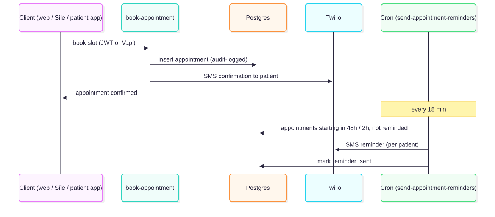

Mermaid source

Mermaid source

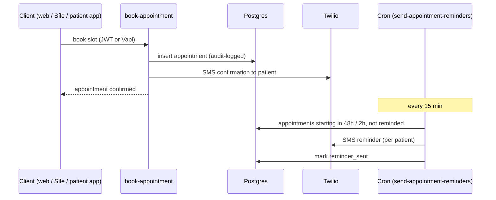

### 3.2 Consultation with AI Scribe

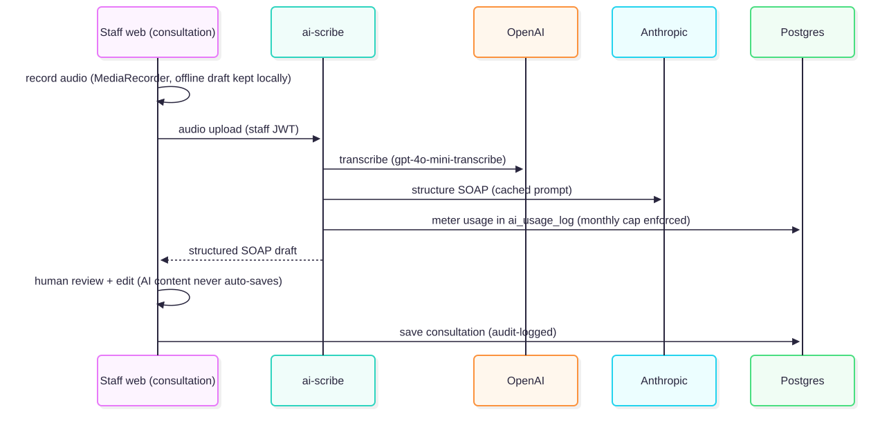

Mermaid source

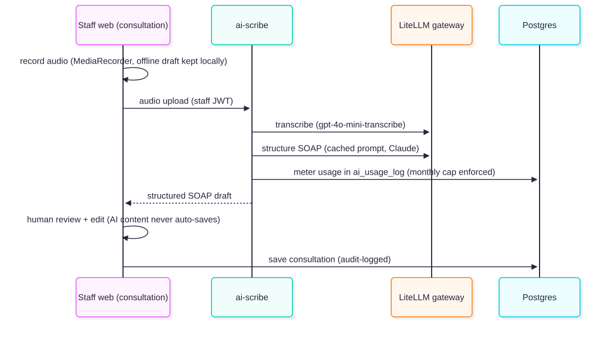

Mermaid source

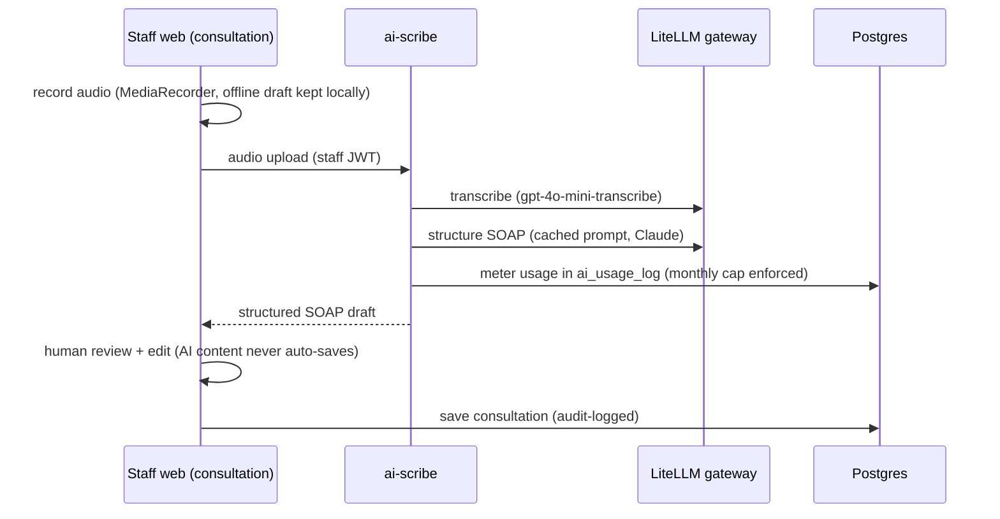

### 3.3 Lab result in (via HealthLink bridge) → GP callback

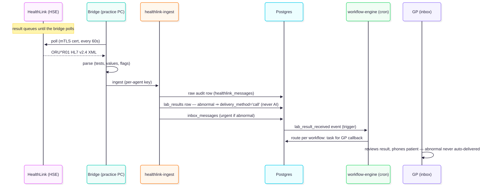

Mermaid source

Mermaid source

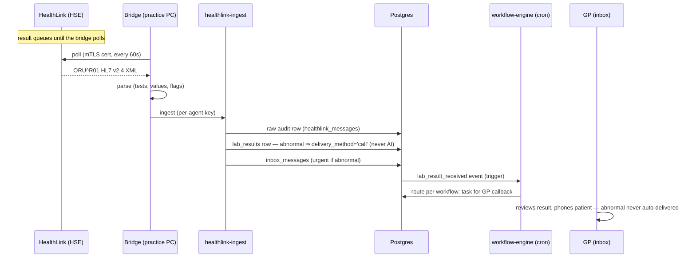

### 3.4 Repeat prescription → GP approval → Healthmail

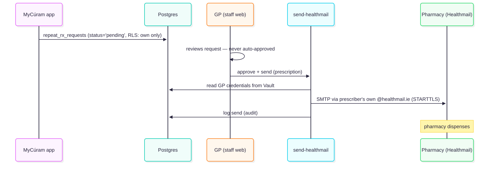

Mermaid source

Mermaid source

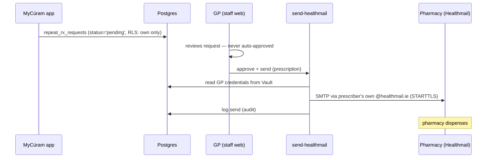

### 3.5 eReferral out (Cúram → HealthLink)

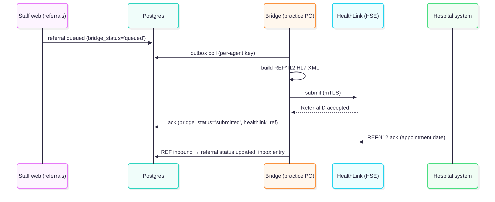

Mermaid source

Mermaid source

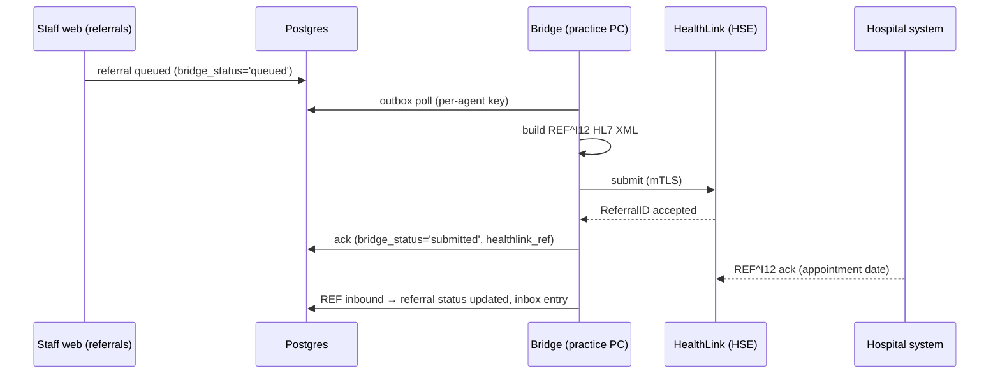

### 3.6 CDM review cycle (nurse → GP → PCRS)

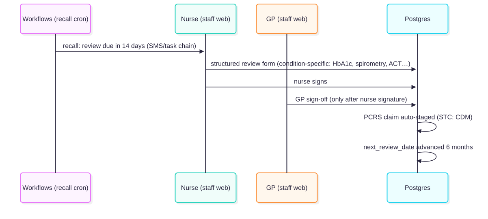

Mermaid source

Mermaid source

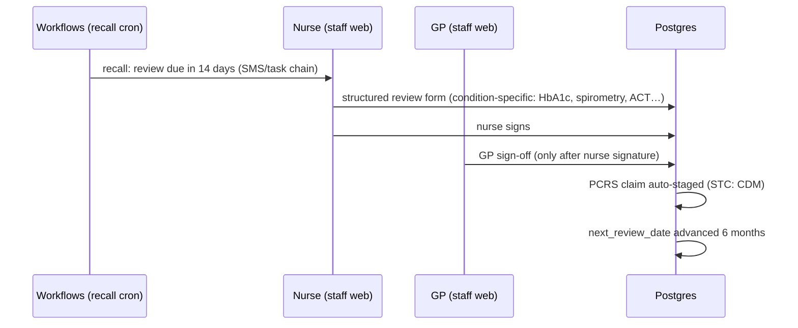

## 4. Cross-cutting rules (enforced in code)

- **Data residency** — Supabase Frankfurt; Vercel EU; no PHI leaves the EU except Twilio SMS (phone + appointment time only) and Stripe (billing contact).
- **RLS everywhere** — staff see their practice via `current_practice_id()`; patients only their own rows via `current_patient_id()`; service-role access limited to Edge Functions.
- **Audit trail** — DB triggers on `patients, consultations, prescriptions, repeat_rx_requests, lab_results, referrals, appointments, invoices` write to `audit_log`.
- **AI is never the final writer** — scribe drafts, referral letters and prescriptions all require human approval; abnormal labs are never delivered by AI (GP callback only).
- **Emergency path** — Síle detects chest pain / breathing difficulty → instructs caller to phone 999/112.

## 5. Operational notes

- **Bridge offline = delayed, not lost.** HealthLink queues messages; the bridge drains them on next start (auto-starts with the OS). Keep the bridge machine on during opening hours.
- **Feature flags** (Supabase secrets): `SMS_ENABLED`, `HEALTHMAIL_ENABLED` — external accounts must be provisioned first (Twilio number, Healthmail IMAP/SMTP confirmation).
- **Pending user-side setup**: LiteLLM gateway URL + key (scribe) or direct OpenAI/Anthropic keys, Twilio number, Stripe test keys + webhook secret, Supabase anon key in `patient-app/app.json`.
- **HealthLink formal integration testing** (month 16 per build plan) provisions the real endpoint + certificate for the bridge.
